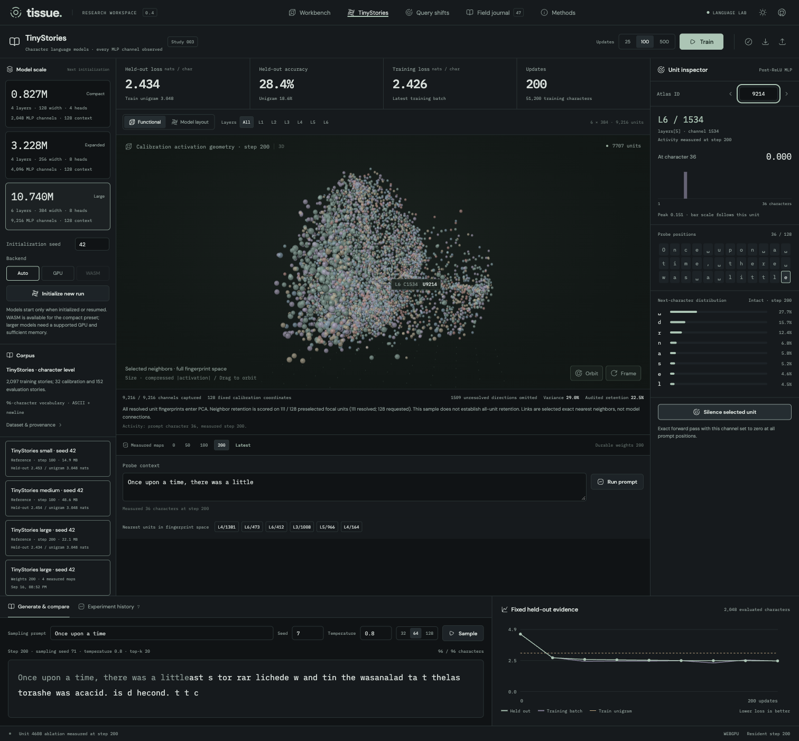

# Tissue

A browser laboratory for discovering useful spatial descriptions of language models trained in the browser. Real training, measured geometry, interventions, and a persistent research journal share one interface.

## Run

```sh
pnpm install
pnpm dev
```

Open the local URL. WebGPU is preferred; initialization validates numerical readback and can fall back to WASM. The first compilation takes a few seconds. **Explore that specimen** loads a measured, trained reference without a training wait. The source model runs entirely in your browser.

## What is here

- A 25,920-parameter causal transformer: two layers, width 32, four heads, 256 MLP neurons.
- A controlled next-token task: `a=3;b=7;c=2;?b → 7`. Answer-only cross-entropy. Whole assignment mappings are disjoint across training, calibration, and evaluation.
- Activation and exact zero-ablation fingerprints, deterministic 3D PCA, temporal Procrustes alignment, original-space neighbor links, and projection-quality measurements.
- A dense dark-default workbench with persistent light mode and HugeIcons. Functional and architectural layouts share the same stable neuron identities.
- Linked model anatomy, token-by-neuron activation matrix, exact weight slices, token responses, original-space neighbor distances, and selected-neuron interventions.
- Instanced shader nodes and similarity edges interpolate measured checkpoint positions while preserving the camera. Intermediate frames are display interpolation, not measurements.
- Development checkpoints and four-arm constrained repair pilots.
- IndexedDB experiment history; JSON export/import includes model, Adam state, RNG, metrics, snapshots, notes, latest raw fingerprints, and repair receipts. Reload resumes the active specimen.
- A curated research notebook that records findings and limitations alongside measured reference runs.

The visualization does not impose a spatial training objective or a brain-shaped layout. Size encodes compressed activation (or intervention strength); color identifies the layer; links mean fingerprint similarity, not causal connections. Projection does lose information—inspect neighbor retention before interpreting a cluster.

## Evidence, including the unhelpful result

Seed 42 was near the 33.3% random input-copy baseline at 500 steps and reached 97.9% on 96 fixed held-out prompts at 2,000 steps. Seed 7 independently exhibited a similar late transition. These are two small-model runs, not a general training guarantee.

Across both final checkpoints, 89–95% of activation-neighbor selections stay within a layer, versus about 69% for intervention neighbors. The two maps share 19–20% of nearest-neighbor selections (the independent-uniform expectation is 2.35%). This descriptive comparison exposes a layer confound; it does not establish a new interpretability method. The in-app Findings tab and [reproducible comparison](docs/fingerprint-comparison.md) preserve the full counts, earlier checkpoints, null definitions, and source hashes.

The first four-arm repair pilot **did not favor functional neighborhoods**. The lesion caused little damage, and unlesioned fine-tuning controls were absent. The next experiments are recorded in the lab, not hidden behind the attractive geometry.

Measured artifacts and provenance live in [`static/experiments`](static/experiments/README.md). The method is described in [`docs/methods.md`](docs/methods.md).

## Paired-query study

Open **Query shifts** to measure the current checkpoint or inspect recorded results for both trained seeds. Three prompts share an identical assignment and order; only the queried variable changes. Every MLP unit is silenced at all positions. Calibration query-effect contrasts define the map and neighborhood selections; disjoint held-out assignments supply the evaluation target.

The [prospectively recorded protocol](docs/query-shifts-design.md) fixes six neighbors, a shared same-layer pool of 32 units matched by calibration full-effect strength, and four comparison methods. Query-effect neighborhoods transfer above the matched random expectation, but full-effect neighborhoods score slightly better in both seeds. See [the results](docs/query-shifts-results.md) for cohort exclusions, per-layer results, matching quality, and limitations.

Completed studies retain raw probes, exact checkpoint identity, and numerical checks in their own IndexedDB archive. The Field journal links to them. Study JSON export/import preserves raw evidence and provenance; analysis is recomputed in a worker when opened. The model, Adam state, and training RNG remain unchanged. Reference studies are clearly distinguished from the current resident model.

```sh
# Keep pnpm dev running; no retraining is required.
pnpm research:query-shifts --seeds 42,7
# Recompute analysis from preserved raw records without running a model.
pnpm research:query-shifts --seeds 42,7 --analyze-only
```

## Larger models and TinyStories



**TinyStories** opens a separate language-model workspace. Its three presets contain **827,392**, **3,227,648**, and **10,739,712** parameters, with **2,048**, **4,096**, and **9,216** individually addressed MLP channels. Four or six causal transformer layers predict the next character using JaxJS in a worker. The larger two presets require WebGPU; the compact preset also supports WASM.

The attributed corpus from Pattern contains 2,097 training stories. The original 184 validation stories are separated into 32 calibration and 152 evaluation stories before window selection. The lab shows cross-entropy and accuracy on 2,048 fixed held-out characters against a training-only unigram baseline. This is a 96-character model with a 128-character context, not a pretrained TinyStories checkpoint. See the [recorded design](docs/stories-design.md), [source attribution](static/data/tinystories/provenance.json), and [dataset license](static/data/tinystories/LICENSE.html).

Every map retains the raw responses of every MLP channel on eight fixed calibration windows at 16 positions each. Feature-covariance PCA avoids an all-neuron distance matrix. Six selected neighbors are queried exactly in the original fingerprint space; projection retention uses 128 activation-independent focal IDs and reports coverage. Undefined directions remain absent. The [geometry validation](docs/stories-geometry-validation.md) distinguishes this sampled audit from an all-unit claim.

Open a recorded specimen to inspect measured maps without allocating its model. Explicitly resume a saved checkpoint to train, run prompt probes, silence a channel at every prompt position, or sample text. Historical maps retain measurements; only the latest checkpoint retains weights. Binary `.tissue` export/import preserves typed activations, learning curves, samples, paired ablation probabilities, provenance, and, when present, exact parameters, Adam state, and training RNG. The public large reference is explicitly inspection-only; initialize a fresh large run to train it. Full large checkpoints can be saved and exported locally.

```sh
# Keep pnpm dev running. Trains each preset on the same 51,200 characters.
pnpm research:stories --presets small,medium,large --output /tmp/tissue-stories --publish
# Audit published binary artifacts, reports, and implementation hashes.
node scripts/audit-stories.mjs
```

The runner preserves each capture before proceeding, records source hashes, and verifies that probes and generation leave weights, optimizer, and training randomness unchanged. Public archives above 20 MiB are served in checksum-verified chunks to respect the adapter's asset limits. At the first 51,200-character budget, held-out loss reached **2.453, 2.454, and 2.434**, against **3.048** for the unigram baseline. Generated text is still fragmented; [recorded results and actual samples](docs/stories-results.md) include those limitations. Different learning rates, batch sizes, widths, and depths make this an initial scale comparison, not a controlled scaling law. [Engine validation](docs/stories-model-validation.md) records the numerical and lifecycle checks.

## Feedback loops

```sh
pnpm check                         # TypeScript, Svelte, and generated runtime types
pnpm exec vitest run --project server # numerical, data, and record contracts
pnpm lint                          # application formatting and lint
pnpm build                         # production worker and app build
pnpm test:e2e                      # production browser flows; install Chromium first if needed
```

Recompute the five-capture geometric comparison without retraining (Node 24+):

```sh
node scripts/compare-fingerprints.mjs
```

The slower research reproduction is separate from routine checks:

```sh
# Keep pnpm dev running in another terminal.
pnpm research:verify --output /tmp/tissue-study --seed 42 --checkpoints 500,2000
```

It saves every requested stage before assessing the final learning threshold, including unsuccessful runs. Results contain source hashes, numerical backend, complete checkpoints, calibration measurements, and evaluation metrics. `--seed 7`, `--backend wasm`, and `--skip-repair` support controlled comparisons.

The first browser run exposed silently incorrect synchronous WebGPU readbacks. Production uses asynchronous readback with known-answer arithmetic and probability-mass checks. Other numerical contracts check capture parity, actual ablation, exact continuation, frozen repair weights, PCA behavior, and corrupt-record rejection.

## Where to work

- `src/lib/stories/`: larger TinyStories models, worker engine, scalable geometry, validated binary archives.
- `src/lib/lab/model/`: controlled task, JaxJS transformer, optimizer, training, interventions, repair.
- `src/lib/lab/protocol.ts`: versioned worker and model data contracts.
- `src/lib/lab/geometry.ts`: measurable fingerprint geometry and diagnostics.
- `src/lib/lab/geometry-worker.ts`: analysis off the UI thread.
- `src/lib/lab/journal.ts`: validated durable experiment records.
- `src/lib/lab/notebook.ts`: the research narrative, including negative findings.
- `src/lib/lab/model-inspection.ts`: neuron addresses and exact checkpoint tensor slices.
- `src/lib/components/`: linked research views, findings, and journal.
- `src/lib/scene/neural-field.ts`: Three.js scene, stable selection, and camera controls.
- `src/lib/scene/field-shaders.ts`: instanced node and edge interpolation shaders.

The original Jaxverse and Pattern projects supplied the browser-training patterns; the JaxJS skill supplied verified array ownership and optimizer conventions. New experiments should preserve these contracts and add evidence to the lab.
