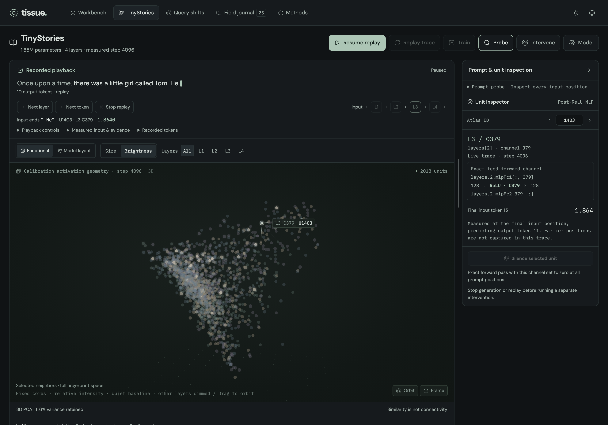

# Tissue

**A browser research lab for seeing what language models learn.** Train small transformers, map measured activations into 3D, follow generation token by token, and test what changes when a channel is silenced.

[](https://neovand.github.io/tissue/?view=tinystories)

_An actual 1.85M-parameter TinyStories BPE model at training step 4,096. Positions are a three-component PCA projection of calibration activations; brightness shows measured next-token activity. The functional map places 2,018 of 2,048 MLP channels with defined fingerprint directions._

[**Open the lab →**](https://neovand.github.io/tissue/?view=tinystories) · [Measured results](docs/token-stories-results.md) · [How the view works](docs/live-activations.md) · [Evidence archive](static/experiments/README.md)

## Start with a trained model

1. Open **TinyStories** and choose **Replay example** in the top action bar. It loads and plays 24 measured token frames without allocating a model. The same primary button pauses and resumes playback.
2. Switch between **Functional** and **Model layout**. Select a channel or choose **Probe** to inspect its exact activation. **Next layer** and **Next token** sit above the network; recorded tokens and raw probabilities are available in the console's disclosures.
3. To generate your own continuation, stop replay, edit the prompt above the network, and choose **Load & generate live**. It restores the open specimen's weights or loads the trained example, then shows the continuation token by token.
4. Use **Train** to start or pause a resident model. **Model** contains initialization, saved runs, continuous/finite training settings, generation settings, import/export, and the character-model comparison. **Intervene** opens single-unit ablation controls and explains any preparation needed.

The network gets the full workspace until you open tools. Drag the tools-panel divider to resize it, or close it to regain the canvas width. **Measurement details** and **Samples & evidence** below the network retain projection diagnostics, training curves, and run history.

The replay specimen contains measurements only. The original specimen contains the trained weights. WebGPU is preferred for training and inference; the compact preset also supports WASM. The first model operation compiles kernels and takes longer than subsequent ones.

## What you can explore

- **Train in the browser.** Continuous training or finite update budgets, held-out loss and accuracy, and a train-only unigram baseline. Maps and complete checkpoints are saved every 100 updates and when training pauses.
- **Follow measured activity.** Each live frame retains all post-ReLU MLP channels at the final input position, the exact input token IDs, and the full next-token distribution. Pause, step, and replay without recomputing a model.
- **Keep the model connection.** Stable layer/channel identities, incoming and outgoing tensor addresses, prompt-position probes, original-space neighbors, and single-channel ablations.
- **Compare spatial descriptions.** Functional activation geometry and architectural coordinates, fixed-size brightness or size encoding, layer filters, and camera-preserving shader rendering.
- **Keep the evidence.** Local IndexedDB history and portable `.tissue` archives retain raw measurements, samples, provenance, and—when present—weights, Adam state, and training RNG. Failed samples and negative results stay in the journal.
- **Explore earlier experiments.** The controlled variable-binding task, paired-query intervention study, and character-based TinyStories models remain separate, inspectable workspaces.

## Model sizes

The subword models use a deterministic **4,096-piece BPE vocabulary**, fitted only on 2,097 training stories. Calibration and evaluation stories are separate; story boundaries and EOS targets are preserved. The corpus averages 4.02 characters per text token. Unsupported prompt characters are rejected explicitly.

| Preset   | Parameters | Layers × width |    Context | Measured MLP channels |
| :------- | ---------: | :------------- | ---------: | --------------------: |
| Compact  |  1,851,392 | 4 × 128        | 128 tokens |                 2,048 |
| Expanded |  5,308,416 | 4 × 256        | 256 tokens |                 4,096 |
| Large    | 13,860,864 | 6 × 384        | 256 tokens |                 9,216 |

The compact preset has a published 4,096-update training run. Expanded and Large passed real one-update WebGPU training, capture, and intervention checks; they are **not a trained model-size comparison**. Larger presets require WebGPU and sufficient browser memory. See the [protocol](docs/token-stories-design.md), [engine validation](docs/token-stories-engine-validation.md), and [data provenance](static/data/tinystories-bpe/provenance.json).

## Read the picture carefully

- **A point is an MLP channel**, with a real address in the model. Attention heads and residual-stream coordinates are not separately visualized.
- **Functional positions summarize calibration responses.** Centered, normalized 128-dimensional activation fingerprints are projected into three PCA coordinates. Undefined directions are omitted; Model layout includes every channel.
- **Links are similarity, not communication.** Selected neighbors are computed in the original fingerprint space. Nearby points in 3D need not be nearby there; the lab reports projection quality beside the map.
- **Brightness is relative within a frame.** Inactive neurons have a visible structural floor; layers outside the playback focus are dimmed. Exact values remain available in the inspector. The scale is not absolute across tokens.
- **Layer pacing is presentation timing.** One measured forward pass is displayed layer by layer. Its final input position predicts the next output token; this is not a recording of GPU execution times or individual neurons firing.

The aim is to find spatial descriptions that help make and test predictions about model behavior. An attractive shape alone does not identify a concept, mechanism, or circuit. [Measurement details →](docs/live-activations.md)

## What we have learned so far

The trained subword specimen processed **1,868,552 supervised targets**. Loss reached **3.560 nats/token**, versus **6.059** for the unigram baseline, with **31.1%** next-token accuracy on 2,040 fixed held-out targets. Continuations have local story-like phrasing but still confuse characters, grammar, and events. This is one seed on a small subset, not evidence of reliable story understanding. [Unedited samples and results](docs/token-stories-results.md)

Its final 3D map retains only **6.12%** of audited six-neighbor memberships and explains **11.56%** of fingerprint variance. Predictive loss improved while projection fidelity varied nonmonotonically. The map is useful to interrogate, but the recorded result does not justify trusting its clusters.

Earlier controlled studies also keep their less favorable findings: activation neighborhoods were strongly confounded by layer; a repair pilot **did not favor functional neighborhoods**; and paired-query neighborhoods transferred above a matched random baseline but scored below full-effect neighborhoods in both tested seeds. [Fingerprint comparison](docs/fingerprint-comparison.md) · [Paired-query results](docs/query-shifts-results.md) · [Repair evidence](static/experiments/README.md)

These are working instruments and bounded experiments, not a claim of a newly established interpretability method. The next useful test is whether neighborhoods predict held-out intervention effects under matched prompts and appropriate controls.

## Run locally

Use **Node.js 24+** and **pnpm**:

```sh
git clone https://github.com/NeoVand/tissue.git
cd tissue
pnpm install
pnpm dev
```

Open the URL printed by Vite. The app runs model computation in browser workers; there is no inference server. Recorded specimens can be inspected before allocating a model. Export important runs: browser storage and memory are finite.

```sh
pnpm check                           # TypeScript and Svelte checks
pnpm exec vitest run --project server # Numerical, data, and archive contracts
pnpm lint                            # Formatting and ESLint
pnpm build                           # Production app and workers
pnpm exec playwright install chromium
pnpm test:e2e                        # Production browser flows
```

For the GitHub Pages build and local preview:

```sh
pnpm build:pages
pnpm preview:pages                   # http://localhost:4180/tissue/
```

The [Pages workflow](.github/workflows/pages.yml) publishes the static app under `/tissue/`. See [deployment and provenance notes](docs/github-pages.md) for configuration, verification, and the historical audit checkout.

## Reproduce and audit

Published records include exact tokenizers, source hashes, raw measurements, checkpoint identities, and declared samples. Their archived data remains unchanged. Deployment changes dataset/archive fetch URLs and the dependency lockfile, so historical source hashes intentionally differ from this checkout. Run strict source-hash audits and original experiment reproductions from the predeployment commit **`73cf9d9`**, following the isolated-checkout instructions in [the provenance notes](docs/github-pages.md). Audits recompute stored arithmetic; they do not substitute for rerunning the model.

```sh
# Recompute published-data diagnostics; no model execution.
node scripts/analyze-token-story-samples.mjs
node scripts/compare-fingerprints.mjs
```

```sh
# In the historical 73cf9d9 checkout, with its dependencies installed:
node scripts/audit-token-stories.mjs --write

# Keep pnpm dev running there in another terminal for browser reproductions.
pnpm research:token-stories --steps 4096 --output /tmp/tissue-token-stories --publish
node scripts/measure-live-stories.mjs --backend webgpu --publish
pnpm research:query-shifts --seeds 42,7
```

`--publish` writes a new reference into the local repository's experiment catalog. The sample audit checks exact training-text overlap and repeated four-grams; it is not a coherence or originality score. Device-specific timings are not isolated throughput benchmarks.

More reproduction paths: [deterministic corpus preparation](scripts/prepare-token-stories.mjs), [controlled training and repair runner](scripts/verify-model.mjs), [character-model scale runner](scripts/measure-stories.mjs), [paired-query protocol](docs/query-shifts-design.md), and [artifact formats and provenance](static/experiments/README.md). The [methods](docs/methods.md) and [character-model results](docs/stories-results.md) preserve the earlier experiments and their limits.

## Code and contributions

Tissue uses **Svelte 5 / SvelteKit, TypeScript, JaxJS + Optax, WebGPU / WASM, Three.js with instanced GLSL shaders, and HugeIcons**. Model execution and geometry analysis run in workers; Svelte connects their measurements to the renderer and persistent research views.

| Location                                                                           | Responsibility                                              |
| :--------------------------------------------------------------------------------- | :---------------------------------------------------------- |
| [`src/lib/token-stories`](src/lib/token-stories)                                   | BPE models, tokenizer, live generation, validated archives  |
| [`src/lib/stories`](src/lib/stories)                                               | Character models and scalable activation geometry           |
| [`src/lib/lab`](src/lib/lab)                                                       | Controlled tasks, interventions, geometry, research journal |
| [`src/lib/components`](src/lib/components)                                         | Linked workbench, probes, playback, findings                |
| [`src/lib/scene`](src/lib/scene)                                                   | Three.js rendering, shader encodings, camera and selection  |
| [`scripts`](scripts) · [`docs`](docs) · [`static/experiments`](static/experiments) | Reproducible runs, protocols, evidence and limitations      |

Contributions are welcome: a sharper experiment, a better diagnostic, or a clearer way to inspect measured behavior. State the hypothesis and comparison before measuring; preserve raw evidence and failures; add meaningful numerical or interaction checks. Keep published source identities reproducible when introducing new model paths, and record the result in the lab rather than only in a screenshot.

TinyStories is by **Ronen Eldan and Yuanzhi Li**; the bundled subset retains its [CDLA-Sharing 1.0 license](static/data/tinystories-bpe/LICENSE.html) and [source provenance](static/data/tinystories-bpe/provenance.json). Jaxverse and Pattern supplied the earlier browser-training and tokenization patterns. Tissue's trained models and measurements are its own experiments, not the TinyStories authors' pretrained checkpoints.
