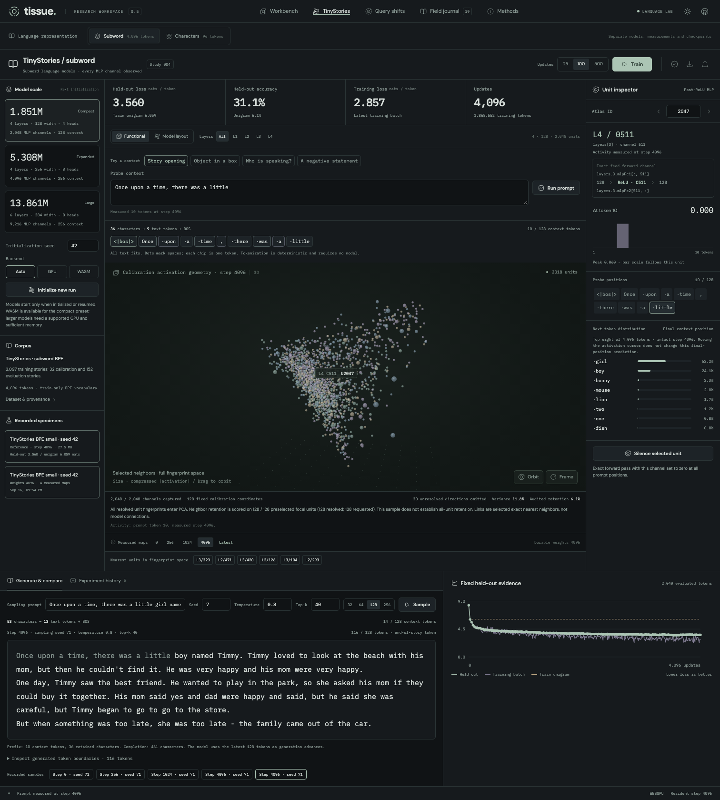

# Study 004 — subword TinyStories

The declared 4,096-update specimen completed on WebGPU with 1,868,552 supervised
nonpadding targets. Held-out loss reached **3.5601 nats/token**, versus **6.0592**
for the training-only unigram baseline. Its samples have story-like local phrasing,
but inconsistent characters, grammar and events. This is predictive learning in
one small model, not reliable story understanding or a new interpretability method.



## Model, data and prior commitments

The model uses 4,096 BPE pieces, four decoder layers of width 128, four attention
heads, 128-token context, 2,048 measured MLP channels and 1,851,392 parameters.
The [protocol](token-stories-design.md) was committed as `1e1e7b5` before the run;
its implementation was committed as `9d54686`. Source-file hashes identify the
executing numerical code and were verified unchanged before publication. The
working tree was marked dirty because interface work was continuing alongside
training; the commit identifier alone is not the complete provenance.

The vocabulary fits only the 2,097 training stories. They contain 443,892 tokens
including BOS/EOS, and average 4.02456 ASCII characters per ordinary text token.
The original 32 calibration and 152 evaluation stories remain separate. A
256-token context fits 148 of the 152 evaluation stories including boundaries;
this first measured small model uses 128 tokens.

TinyStories is by **Ronen Eldan and Yuanzhi Li**. The [upstream dataset](https://huggingface.co/datasets/roneneldan/TinyStories), [source-recovery provenance](../static/data/tinystories-bpe/provenance.json), and [bundled CDLA-Sharing 1.0 license](../static/data/tinystories-bpe/LICENSE.html) accompany this subset.

Training uses fixed chunks of up to 128 targets within each story. Later chunks
reset their context and positions; the model does not see the complete preceding
history of a longer story. EOS is a supervised target, and padding is excluded.
Length-proportional chunk sampling with mean per-chunk loss gives the corpus
per-token objective in expectation; the [engine validation](token-stories-engine-validation.md)
records the calculation and tests.

## Measurements

All four declared captures are retained. The final row is the scheduled endpoint,
not a checkpoint chosen for its best evaluation score.

| Updates | Supervised training targets | Held-out nats/token | Token accuracy | Audited 3D neighbor retention |
| ------: | --------------------------: | ------------------: | -------------: | ----------------------------: |
|       0 |                           0 |              8.3180 |          0.05% |                         3.65% |
|     256 |                     117,262 |              4.4858 |         19.71% |                         9.24% |
|   1,024 |                     467,769 |              4.0461 |         24.61% |                         5.47% |
|   4,096 |                   1,868,552 |              3.5601 |         31.08% |                         6.12% |

The train-only smoothed unigram baseline scores 6.0592 nats/token and 6.08%
accuracy on exactly the same 2,040 nonpadding evaluation targets. This fixed
evaluation selects 16 windows from the evaluation pool, not every token of all
152 stories. Loss is in nats per BPE token, so the character-model losses in
Study 003 are different units. The final minibatch training loss was 2.8571;
it is not a full-corpus training evaluation.

## Samples, including their failures

Every declared capture uses prompt `Once upon a time`, sampling seed 71,
temperature 0.8, top-k 40, and at most 128 new tokens. The exact final continuation
is reproduced below with its prompt, without editing or retries:

```text
Once upon a time, there was a little girl called Tom. He had a great idea and a flower. One day, he was feeling very curious and wanted to find something new. He grabbed his hand and grabbed onto the fruit, so he started to try it.
He hopped and began to move. He looked around, but then he saw a big pile of leaves. He heard a loud noise. It was big, like it was smelly. The sun was shining and the sky was full of green and the sky. It was a great idea and sweet fruit.
After the sun started to move around the sun was a little girl. The little
```

The opening changes from a girl to “He,” and later sentences lose event and
character continuity. Those failures remain visible in the specimen. Whole words
already appear in the untrained sample because they are vocabulary entries;
word-shaped output alone is not evidence of learned language.

The runner also sampled its fixed extended probe prompt after the last capture.
This second final sample stopped at EOS after 115 text tokens plus one EOS token:

```text
Once upon a time, there was a little boy named Timmy. Timmy loved to look at the beach with his mom, but then he couldn't find it. He was very happy and his mom were very happy.
One day, Timmy saw the best friend. He wanted to play in the park, so she asked his mom if they could buy it together. His mom said yes and dad were happy and said, but he said she was careful, but Timmy began to go to go to the store.
But when something was too late, she was too late - the family came out of the car.
```

It also mixes pronouns, repeats phrases and introduces an unexplained car. EOS
termination demonstrates the boundary mechanism, not a satisfactory story ending.

The [independent sample audit](../static/experiments/token-stories-sample-audit.json)
compares every completion against training stories, excluding the prompt and
preventing matches across story/BOS/EOS boundaries:

|                Updates | Generated text tokens | Longest exact training span (tokens) | Repeated four-token excess occurrences | Stop             |
| ---------------------: | --------------------: | -----------------------------------: | -------------------------------------: | ---------------- |
|                      0 |                   128 |                                    2 |                                      0 | 128-token budget |
|                    256 |                   128 |                                    7 |                                      0 | 128-token budget |
|                   1024 |                   128 |                                   10 |                                      2 | 128-token budget |
|                   4096 |                   128 |                                    9 |                                      2 | 128-token budget |
| 4096 (extended prompt) |                   115 |                                    9 |                                      0 | EOS              |

The final scheduled sample's longest match is `. The sun was shining and the sky was`;
the extended-prompt sample's is ` he couldn't find it. He was`. Formulaic language
naturally overlaps. These descriptive measurements neither establish originality
nor rule out memorization, and are not coherence scores. All five raw samples and
their exact token IDs remain selectable in the lab.

## What the shape means

Each point is a post-ReLU MLP channel with an exact incoming-column and
outgoing-row address. Its fingerprint uses 128 raw activation measurements from
eight calibration windows and 16 actual token positions per window. Short
windows are sampled across their real length; padding never supplies a geometric
coordinate. Both token IDs and actual sampled positions are archived and included
in geometry identity.

Centered, normalized fingerprints define similarity. Three PCA coordinates are
an approximation, and the interface reports the audited neighbor loss next to
the graph. Final explained variance is **11.56%**. All 2,048 channels were captured;
**2,018** have a defined direction after centering and normalization. The other 30
are unresolved on this calibration set, not demonstrated globally inactive units.

The final projection retains **6.12%** of six-neighbor memberships across all 128
prespecified focal units. Retention rose at 256 updates, fell at 1,024, and partly
recovered at 4,096 while predictive loss improved. This run gives no monotonic
relationship between learning and projection fidelity. Original-space neighbors
and links use all 128 measured dimensions. These observations do not identify
concepts, circuits, or causal communication paths.

At the final checkpoint, the runner silenced unit 1024 (zero-based layer 2,
channel 0) at every position of `Once upon a time, there was a little`.
The largest change in a next-token probability was **4.53e-6**. Raw intact and
ablated distributions are retained. There is no repeated-forward numerical
control for this probe, so its small effect does not establish a substantive role.
Parameters, Adam moments, optimizer step and training RNG were exactly unchanged
after probing and generation, as checked by the runner.

## Evidence and practical use

The [raw report](../static/experiments/token-stories-small-seed-42-step-4096-cdded5d8-report.json),
[independent audit](../static/experiments/token-stories-audit.json), and
[reference catalog](../static/experiments/token-stories-index.json) pin the complete
27,502,765-byte resumable archive by SHA-256:

`4daa2e6e3e9a08d07bbd93464c4f20c6f961539bc3f07fa5a7efd905acd00f12`

The public archive includes all four raw maps, learning curves, all five samples,
selected-channel intervention probabilities, and the final weights, Adam state
and training RNG. Complete intermediate checkpoints are also retained under
`.local-experiments/token-stories-v1/`; [copy checksums](../static/experiments/token-stories-local-copies.json)
record them. The independent audit checks identities and stored arithmetic; it
does not rerun the model or fit PCA again. A separate browser successfully loaded
the published reference, resumed step 4,096 and ran a token-linked prompt probe
with no page errors. The screenshot above comes from that check.

The **5.31M** and **13.86M** subword presets also executed actual WebGPU training,
all-channel capture, sampling and intervention in one-update engineering checks.
The full **1.85M** preset ran on WASM with the GPU disabled. See
[engine validation](token-stories-engine-validation.md) for exact scope and raw
receipts; these checks establish execution, not trained large-model quality.

## Limits and next useful test

One seed, one sustained run, a small training subset and sixteen fixed evaluation
windows do not establish general language quality. Tokenization, parameter count,
effective context and training budget change together relative to Study 003, so
this is not a tokenizer ablation. Sampling settings and prompt affect the prose.
Training and validation ran alongside other browser checks on the same machine;
recorded timings are not isolated throughput benchmarks.

The next interpretation experiment should hold this checkpoint fixed and
manipulate one story fact across matched prompts—an object's location or a
character's attribute—then test whether neighbors selected on calibration
responses predict held-out changes under interventions. Repeated intact controls,
original-space comparisons, same-layer baselines and disjoint prompt templates
are needed before interpreting a spatial region. The current map is an instrument
for that test, not its conclusion.
